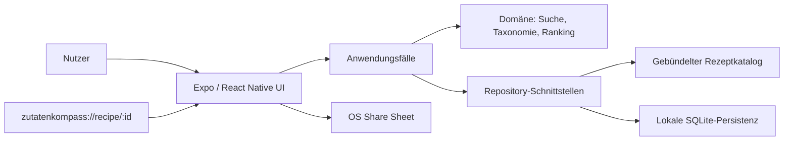
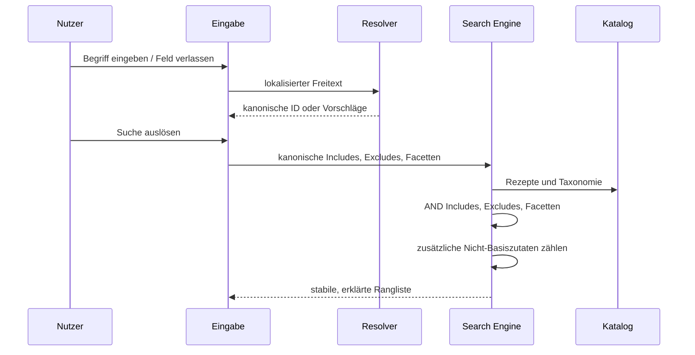

# Architektur

Dieses Dokument beschreibt die bestätigte Zielarchitektur. Das Backlog kennzeichnet, welche
Teile bereits umgesetzt, in Arbeit oder noch geplant sind.

## Ziele

ZutatenKompass ist local-first und backendlos. Der zentrale Qualitätstreiber ist nicht
Netzwerkausfallsicherheit, sondern die Garantie, dass der komplette Kernpfad nach Installation
ohne Netzwerk funktioniert: Eingabe, Vorschlag, Suche, Filter, Ranking, Details, Sprache,
Favoriten und Sharing-Vorbereitung.

## Kontext

Es existiert in V1 kein eigener Server. Das Betriebssystem erhält nur nach einer bewussten
Teilen-Aktion Text und einen Custom-Scheme-Link.

## Schichten

### Präsentation

Expo-Router-Screens und wiederverwendbare Komponenten stellen Start, Ergebnisse, Detail,
Favoriten und Einstellungen dar. Präsentationscode kennt lokalisierte View-Modelle, aber
keine SQLite-Abfragen und keine unnormalisierten Katalogstrukturen.

### Anwendung

Use Cases orchestrieren:

- Zutatenbegriff auflösen und Vorschläge erzeugen
- Suchanfrage kanonisieren
- Rezepte filtern und ranken
- Favorit toggeln und lesen
- Sprache wählen
- Share Payload erzeugen
- Deep Link in stabile Rezept-ID überführen

### Domäne

Reine TypeScript-Funktionen besitzen die fachliche Semantik. Kerntypen sind:

- `RecipeId`, `IngredientId`, `FacetId`
- lokalisierter Text mit `de` und `en`
- `Recipe`, `RecipeIngredient`, `IngredientNode`, `FacetSelection`
- `SearchQuery` mit Includes, Excludes und Facettengruppen
- `SearchResult` mit Score und Match-Erklärung

Die Domäne hat keine React-, Expo-, SQLite- oder Netzwerkabhängigkeit.

### Infrastruktur

- Ein Katalogadapter lädt validierte, gebündelte Daten.
- Ein Persistenzadapter verwaltet Favoriten, Sprache und Schema-/Katalogversion.
- Ein Plattformadapter kapselt Share Sheet und Linkerzeugung.
- Der bibliotheksneutrale Katalogwert `visualKind` wird zentral auf ein lokal gebündeltes
  Rezepticon, eine kontrastreiche Farbwelt und einen Zutaten-Badge abgebildet.

## Datenfluss der Suche

## Suchinvarianten

1. Alle Includes müssen semantisch getroffen sein.
2. Weitere Zutaten sind erlaubt und bestimmen das Ranking.
3. Jede semantische Überschneidung mit einem Exclude entfernt das Rezept.
4. Werte innerhalb einer Facettengruppe sind OR-verknüpft; belegte Gruppen sind AND-verknüpft.
5. Generische Zutaten werden über eine validierte, azyklische Taxonomie aufgelöst.
6. Gleichstände haben eine stabile Reihenfolge.
7. Anzeigenamen sind niemals Identitäten; IDs bleiben über Sprachwechsel stabil.

## Katalogstrategie

Quellen sind originär erstellte, versionierte Projektdaten. Ein Build-/Validierungsschritt
prüft mindestens:

- 100 oder mehr eigenständige Grundrezepte mit 1.290 oder mehr konkreten Varianten
- stabile `baseRecipeId` und `techniqueSignature` zur Trennung von Grundgericht und Austauschvariante
- höchstens ein Suchtreffer je `baseRecipeId`; der Score der besten zulässigen Variante entscheidet
- Eindeutigkeit und Referenzintegrität
- vollständige DE-/EN-Felder
- Zutatenhierarchie ohne Zyklen und Alias-Kollisionen
- plausible Wertebereiche
- Facettenwerte aus kontrolliertem Vokabular
- mindestens drei Nicht-Basiszutaten und drei echte Schritte
- gültiger, innerhalb einer `baseRecipeId` konsistenter `visualKind`

Ein Katalogupdate darf bestehende stabile IDs nicht unbemerkt wiederverwenden.

## Persistenz

SQLite ist ein Implementierungsdetail hinter Repository-Verträgen. Mindestens gespeichert werden:

- Favoriten als stabile Rezept-IDs
- explizit gewählte Sprache
- Schema- und Katalogversion

Die eigentlichen Rezepte bleiben als versioniertes, gebündeltes Produktartefakt verfügbar.
Migrationen sind vorwärtsgerichtet, idempotent und getestet. Unbekannte Favoriten-IDs werden
sicher ignoriert oder als nicht mehr verfügbar dargestellt.

## Navigation und Links

Expo Router bildet `recipe/[id]` als dynamische Route ab. Das Scheme `zutatenkompass` erzeugt
Links der Form `zutatenkompass://recipe/<id>`. Eingehende IDs werden validiert und niemals als
Dateipfad oder Abfrage interpretiert. In V1 existiert absichtlich kein HTTPS-, Web- oder
Store-Fallback.

## Internationalisierung

Lokalisierte Inhalte bleiben an stabilen Domänenobjekten. Die Auflösung geschieht am Rand zur
Darstellung und Suche. Beim Sprachwechsel werden keine Chips neu aus Freitext erzeugt; ihre
kanonischen IDs bleiben bestehen und erhalten nur neue Labels.

## Fehler- und Sicherheitsgrenzen

- Ungültiger Katalog ist ein Buildfehler, kein tolerierter Produktionszustand.
- Ungültige Deep Links führen zu einem sicheren Nicht-gefunden-Zustand.
- Persistenzfehler werden abgefangen und in der UI verständlich gemacht.
- Excludes werden sichtbar als Komfortfilter bezeichnet.
- Es gibt keine dynamische Codeausführung, keine Geheimnisse im Client und keine Remote-Datenquelle.

## Performancebudgets

- Suche und Filter sollen bei 1.290+ Varianten auf einem typischen Android-Gerät ohne wahrnehmbares
  Blockieren reagieren; als Testziel gelten 100 ms für reine Domänenlogik im repräsentativen
  Katalog auf CI-Hardware, nicht als Geräte-SLA.
- Ergebnislisten virtualisieren Einträge.
- Katalogindizes und vorberechnete Taxonomiebeziehungen dürfen erzeugt werden, sofern sie
  deterministisch aus der Quelle entstehen.
- App-Start und Datenmigration dürfen nicht bei jedem Render wiederholt werden.

## Änderungsregeln

- Neue externe Dienste benötigen Datenschutzprüfung und ADR.
- Änderungen an ID-, Such-, Facetten- oder Rankingsemantik benötigen Migrationstests.
- Neue Sprache benötigt vollständig validierte UI-, Zutaten-, Facetten- und Rezeptübersetzungen.
- Remote-Medien bleiben deaktiviert, bis ADR, Lizenzmanifest und Offline-Fallback akzeptiert sind.

## Versionierte technische Referenzen

- [Expo SDK 57](https://docs.expo.dev/versions/v57.0.0/)
- [Expo Router für SDK 57](https://docs.expo.dev/versions/v57.0.0/sdk/router/)
- [Expo Localization für SDK 57](https://docs.expo.dev/versions/v57.0.0/sdk/localization/)
- [Expo SQLite für SDK 57](https://docs.expo.dev/versions/v57.0.0/sdk/sqlite/)
- [Expo Linking für SDK 57](https://docs.expo.dev/versions/v57.0.0/sdk/linking/)

Vor Änderungen an Expo-APIs gelten die exakt versionierten SDK-57-Dokumente und `AGENTS.md`,
nicht unversionierte Beispiele.
